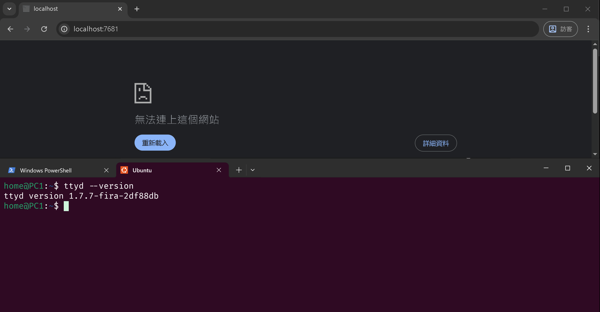

# ttyd-firacode-nerdfont

`ttyd-firacode-nerdfont` is a fork of [ttyd](https://github.com/tsl0922/ttyd), built with `FiraCode Nerd Font`.



# Installation

- Download pre-built binary from [Releases Page](https://github.com/Bowen951209/ttyd-firacode-nerdfont/releases).
- Build from source:
    ```bash
    git clone https://github.com/Bowen951209/ttyd-firacode-nerdfont.git
    cd ttyd-firacode-nerdfont && mkdir build && cd build
    cmake .. && make && sudo make install
    ```

# Usage

`Fira Code Nerd Font` is already configured in the source, so simply run (on Linux)

```bash
ttyd -W bash
```

# Alternatives

* [metorm/ttyd-nerd-font](https://github.com/metorm/ttyd-nerd-font) - `JetBrainsMono Nerd Font` & `Sarasa Mono SC`.

## Some Notes

To enable ligatures in `xterm.js`, I had to use the DOM renderer, so you may experience poorer performance than the deafult WebGL. There is a `xterm.js` addon [@xterm/addon-ligatures](https://www.npmjs.com/package/@xterm/addon-ligatures), but it requires `Node.js` environment like `Electron`, so it is not suitable for this project.
